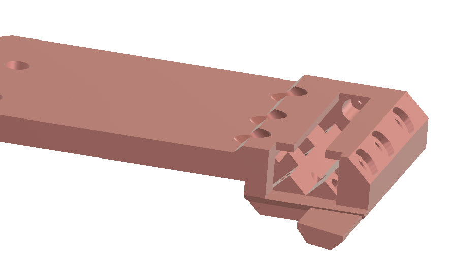
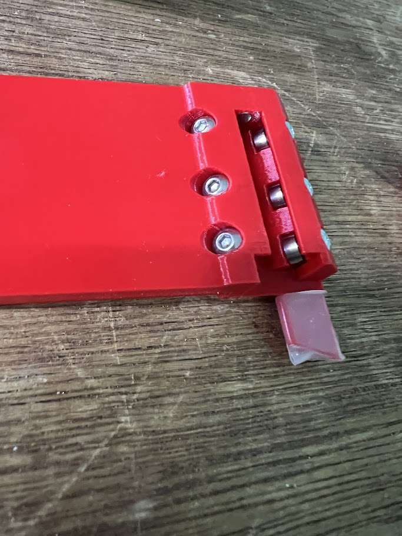
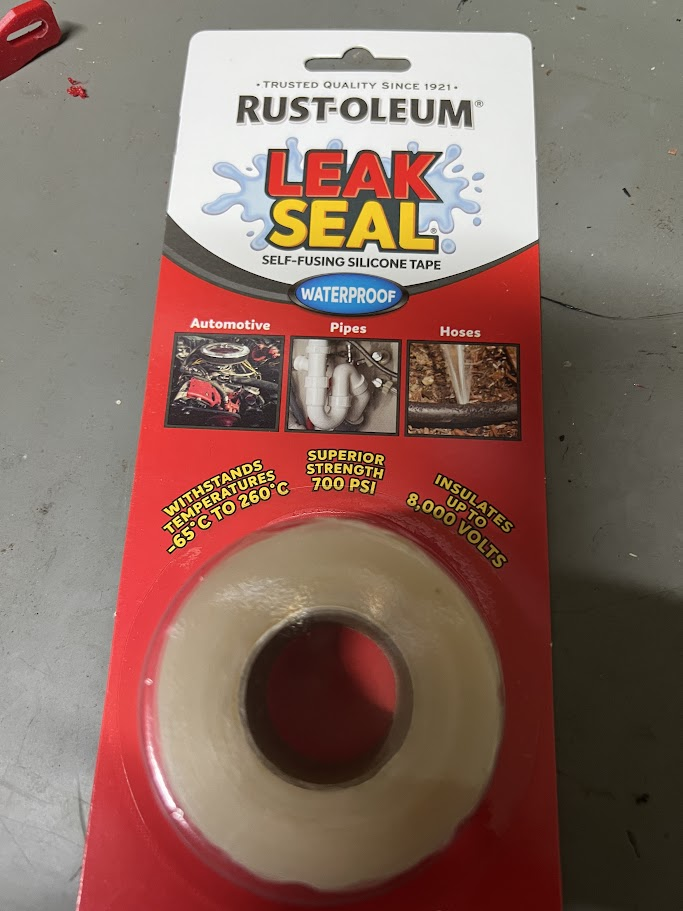
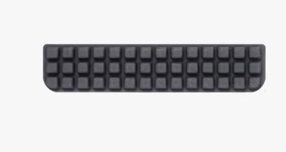
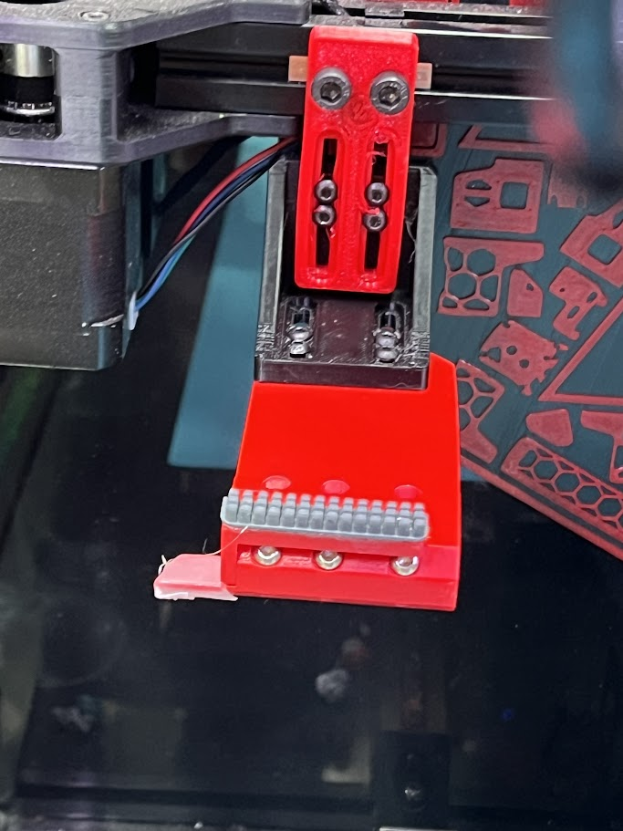
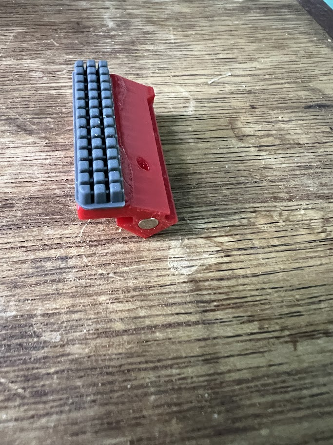
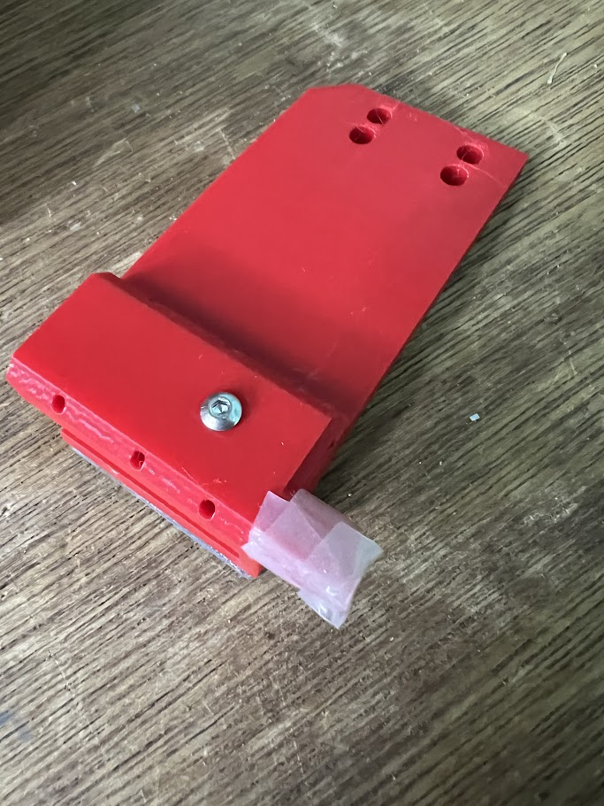

# Gantry Mounted Nozzle Scrubber with poop eject

Here's a design for a nozzle scrubber that ejects poop as needed.

[Video Here](https://youtu.be/P8CdES0VPNM)

The scubber has a moving head riding on 6 small bearings that pushes any poop off the poop-deck during the scrubbing motion.

# PoopDeck

This is the location for any poop during a filament change. I recommend covering this with a thin layer of silocone.

For example this tape (many similar tapes available) is easy to attach, wrapping like a rubber band around the deck.

# Scrubber

The scrubber I've attached is a standard bambu-labs style silicone brush. Other brush styles can be used, but keep the depth similar.

# Auto-return

Magnets ensure the scrubber stays in place when not in use. 

# BOM

2x 4mmx5.7mm Magnets
7x 6mm m3 bolts (holding bearings, and brush stop)
8x 10mm m3 bolts (L bracket assembly)
2x 10mm m4 bolts
2x m4 2020-slidein nuts
6x MR63ZZ bearings
Self-Fusing silicone tape

# Build Notes.

The magnet and bearing holes all have small holes into their bases to allow easy removal if needed.

After sliding on the slider, use a 6mm m3 bolt in the base to stop the slider being removed.

A suggested cleannozzle macro is included in the macros/ folder. Modify the x/y positions at the start of the macro as needed.

> [gcode_macro CLEAN_NOZZLE_GANTRY]\
> description: Clean nozzle using sliding gantry brush\
> `#` Define the location where the poop will land, all other locations will be based off\
> `#` this position. It should be the center of the silicone coated poop tray, 5mm left of\
> `#` left edge of the rubber nozzle brush.\
> variable_x_poop: 18\
> variable_y_poop: 300 \
> variable_number_wipes: 3

 