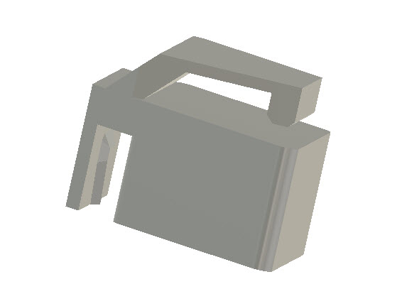
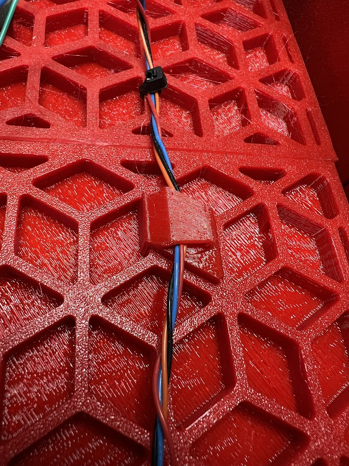
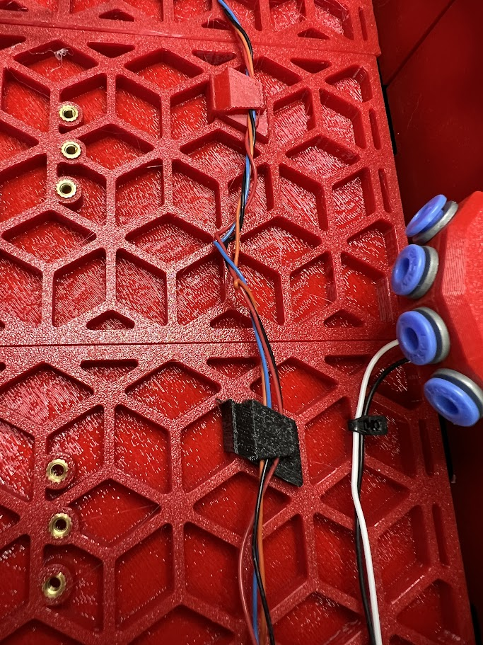

# BoxTurtleLid - EXTRAS

# Plugin wire clip holder

A simple replacement for using zipties to hold down wiring.

My sausage fingers have trouble threading zip-ties, and I like the ability to remove / add wires at any time.

I printed in PETG to give it a little extra flex.

This unit just inserts in using the zip-tie hole to securely clip in. The wires can then be clipped under the top clip part.

If bottom facing mounts required, then just mirror the part in the slicer.

[video](https://www.youtube.com/watch?v=fOTQHvDfOQY)