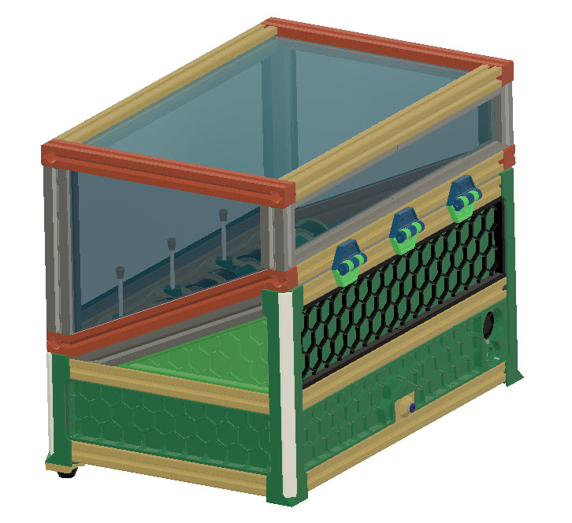
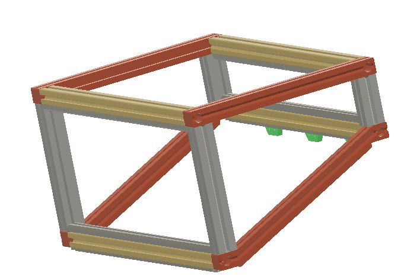
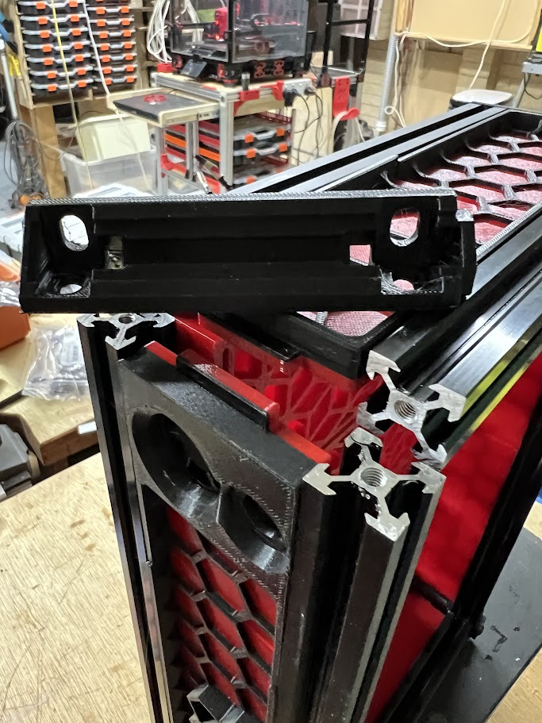
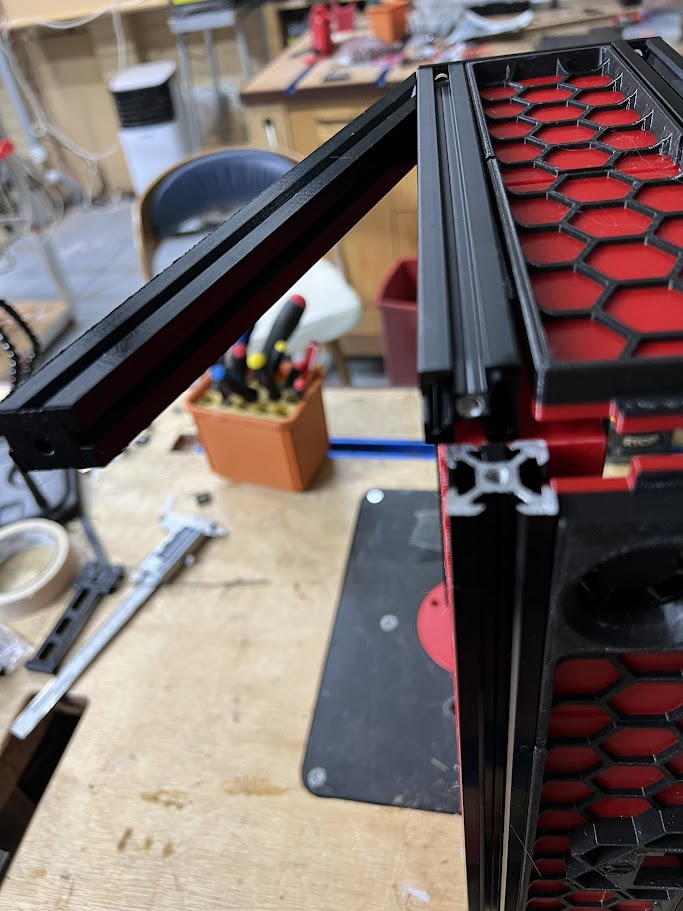
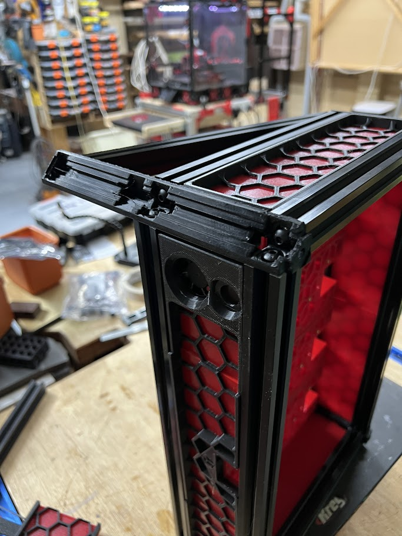
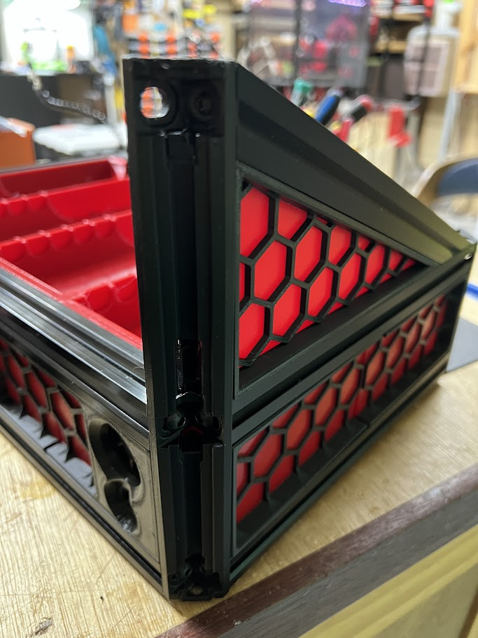
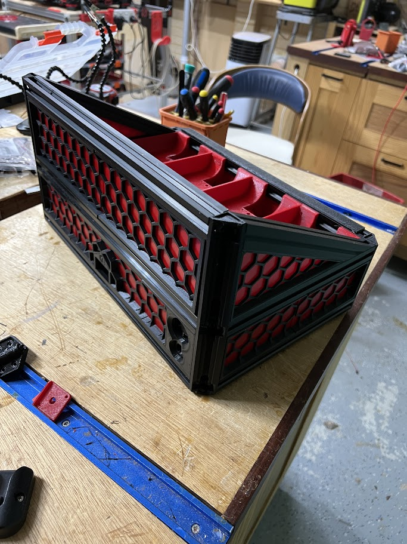
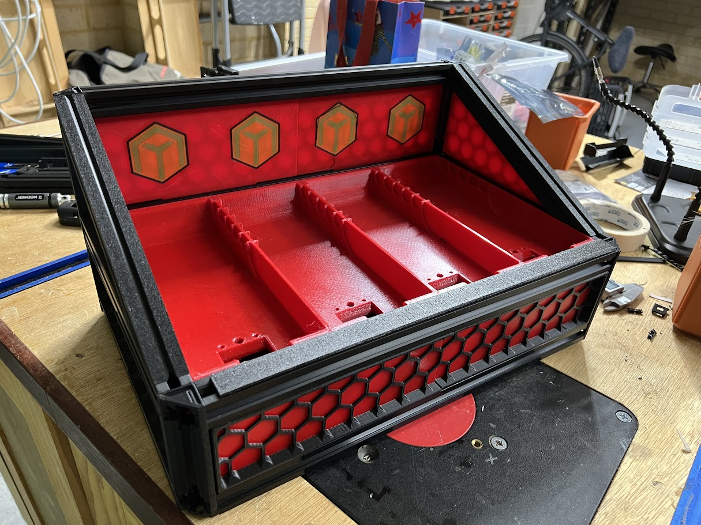

# BoxTurtleLid
Lid / Hat for BoxTurtle Automated Filament

Simple lid for the BoxTurtle.

Requires 4 additional 2020 360mm aluminum extrusion - a printed alternative is included (Printable2020Extrusion) if prefered.

Additionally 5 x 3mm acrylic panels are required.

THIS PROJECT IS CURRENTLY IN DEVELOPMENT - I WILL UPDATE HERE ONCE COMPLETED.

HOWEVER ALL STL's ARE CORRECT AT THIS POINT.

## Current status

Design is complete, I'm just waiting on some additional 2020 to complete the lid build.

I'm also creating a version to allow the triangular side panels to replaced with air-ports for a polymaker polydryer addition.

Build photos...

---

## BOM

4 x 2020 Extrusion 360mm (Note: Can optionally 4e printed - see stl's)

3mm Clear acylic panel cut as follows..

Top: 370 x 225
Front: 370 x 154
Rear: 370 x 54
Sides(x2): 216(topedge) x 165 (BackEdge) x 66 (FrontEdge) x 232 (SlantedBase)

Screws..

6x m3 8mm
6x m3 8mm
2x m3 heatset inserts

Hinges:
6x m3 15mm
12x m3 tnuts
12x m3 6mm

---
## Print Notes

Note that several of the STL require the addition of supports. Alignment and addition of supports I leave to user.

## Build Instructions
1. Place a 3m heat insert into the two angled 2020 pieces.

2. Remove one of the rear legs, this will be replaced.

Before replacing, insert the angular 2020 looking piece into the 2020 extrusion as show.

3. Insert the triangular side panel.

4. Ensure the new longer leg is the correct side. The top hole which connects to the heatset insert is smaller than the other holes.

Replace the leg.

NOTE: The insertion of lights, and covering of the leg is the same as the original BoxTurtle instruction (only longer) - so these details arn't covered here.

5. Repeat steps (1-4) for the other rear leg.

6. Insert the rear panel(s) and attach the top 2020 extrusion

WIP...