# BoxTurtleLid
Lid / Hat for BoxTurtle Automated Filament

Simple lid for the BoxTurtle, with option for filament dryer using a Polydryer base.

Requires 3 additional 2020 360mm aluminum extrusion - a printed alternative is included (Printable2020Extrusion) if prefered.

Note: The 2020 extrusion for the base front of the lid should either be printed, or some modification will be required to close correctly over the four lightboxes.

Additionally 5 x 3mm acrylic panels are required.

[Video Here](https://youtube.com/shorts/PpAaRm0n1hM)

## Current status

Design is now complete.

Build photos...

Here's the basic build of the hat, without heater.

 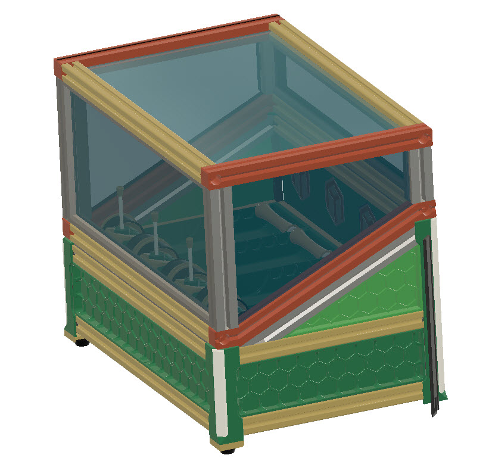
 

The four long extrusions may be 3d printed if required (see stl/Printable2020Extrusions)
All other components are printed. (I'd suggest ABS or ASA if using heater).

The build requires the replacement of the two rear corners with longer versions

An additional rear panel(s) are provided - along with the triangular side panels. 

If making the heater version, then these are replaceable using magnets. See video - 
[Video Here](https://youtube.com/shorts/PpAaRm0n1hM)

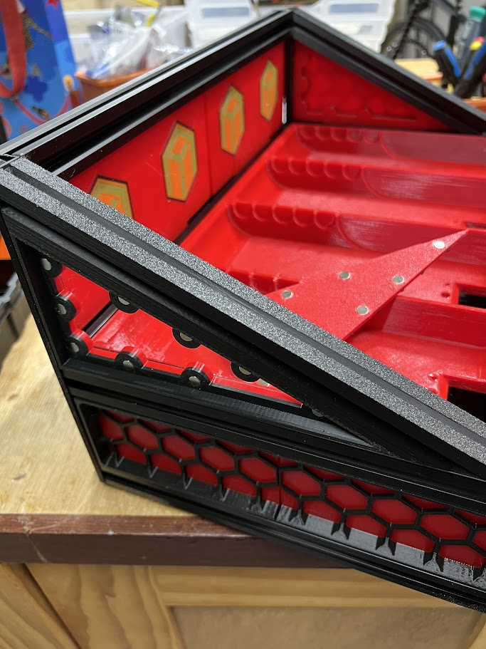
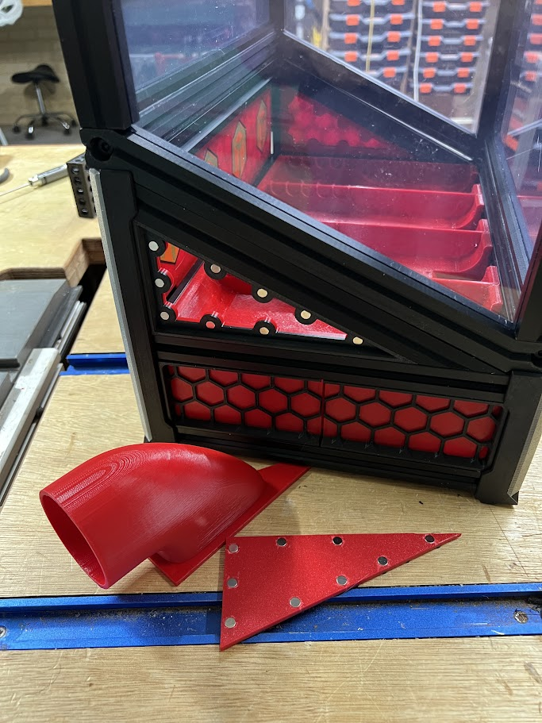
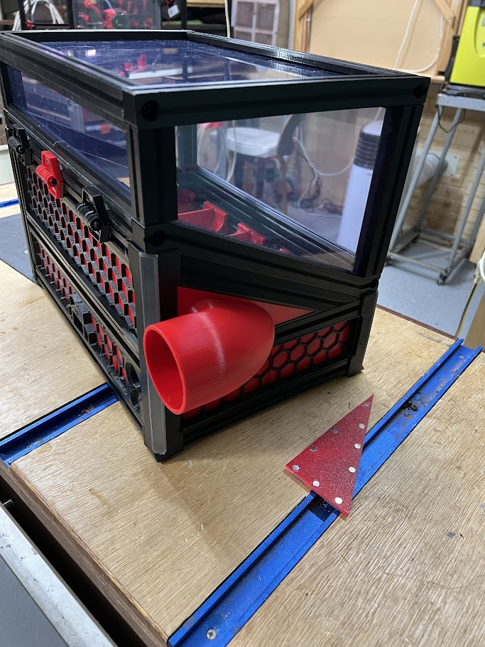
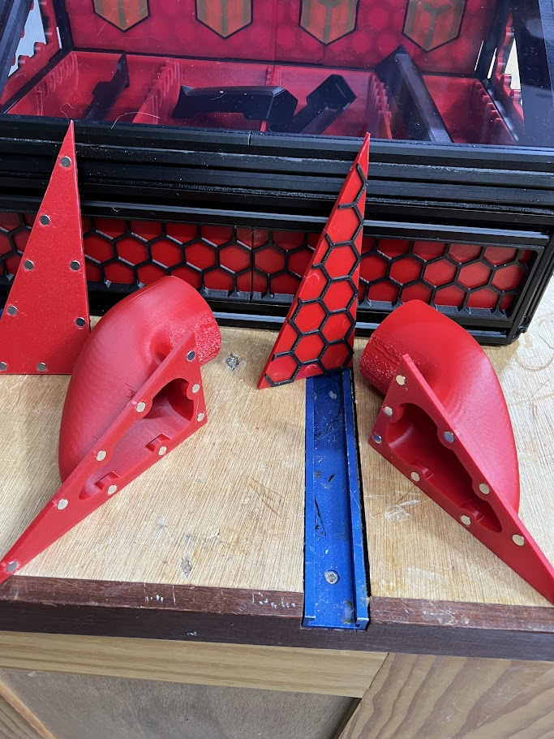

The heater is mounted on the rear just above the outbound ptfe tube on a clipped on table.

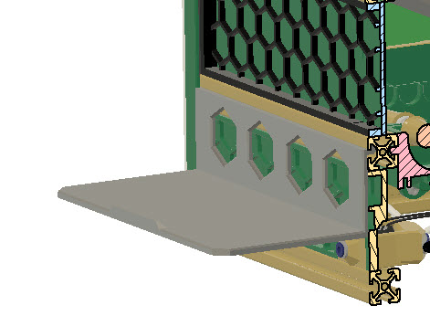

---

## BOM

4 x 2020 Extrusion 360mm (Note: Can optionally 4e printed - see stl's)

3mm Clear acylic panel cut as follows..

Top: 370 x 225
Front: 370 x 154
Rear: 370 x 54
Sides(x2): 216(topedge) x 165 (BackEdge) x 66 (FrontEdge) x 232 (SlantedBase)

### Screws..

6x m3 8mm

6x m3 8mm

2x m3 heatset inserts

### Hinges:

6x m3 15mm

12x m3 tnuts

12x m3 6mm

Heater addition

54 x 6x3 magnets (cheap ones - neodymium magnets NOT needed)

---
## Print Notes

Note that several of the STL require the addition of supports. Alignment and addition of supports I leave to user.

## Build Instructions

### BT modifications

1. Place a 3m heat insert into the two angled 2020 pieces.

2. Remove one of the rear legs, this will be replaced.

Before replacing, insert the angular 2020 looking piece into the 2020 extrusion as show.

3. Insert the triangular side panel.

4. Ensure the new longer leg is the correct side. The top hole which connects to the heatset insert is smaller than the other holes.

Replace the leg.

NOTE: The insertion of lights, and covering of the leg is the same as the original BoxTurtle instruction (only longer) - so these details arn't covered here.

5. Repeat steps (1-4) for the other rear leg.

6. Insert the rear panel(s) and attach the top 2020 extrusion

7. Clip the TPU seals into the front and rear 2020 extrusions. This is a simple press fit.

### Top Hat

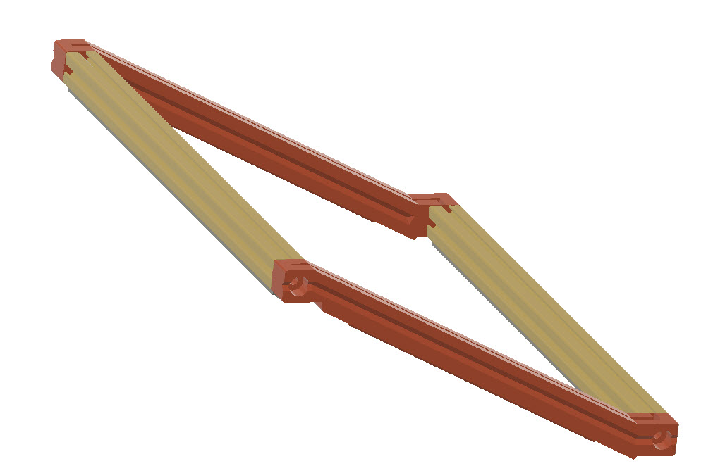

2. The two rear-uprights prints in a U shape, for insertion into the top and bottom 2020 extrusions.

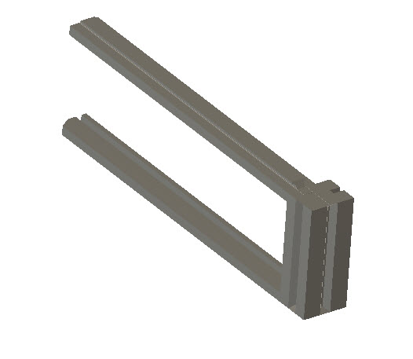

Insert as shown below - inserting the rear clear panel at this point.

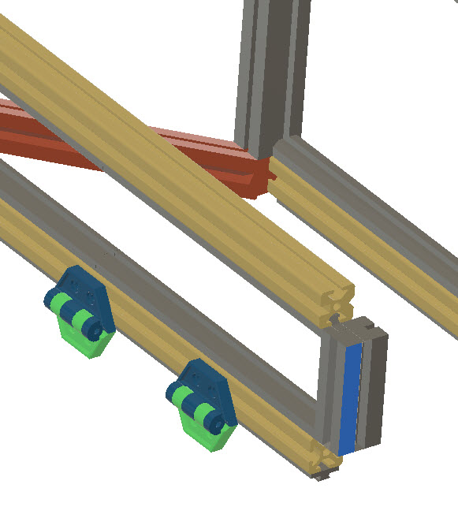

3. Repeat for the front-uprights inserting the front clear panel at the same time.

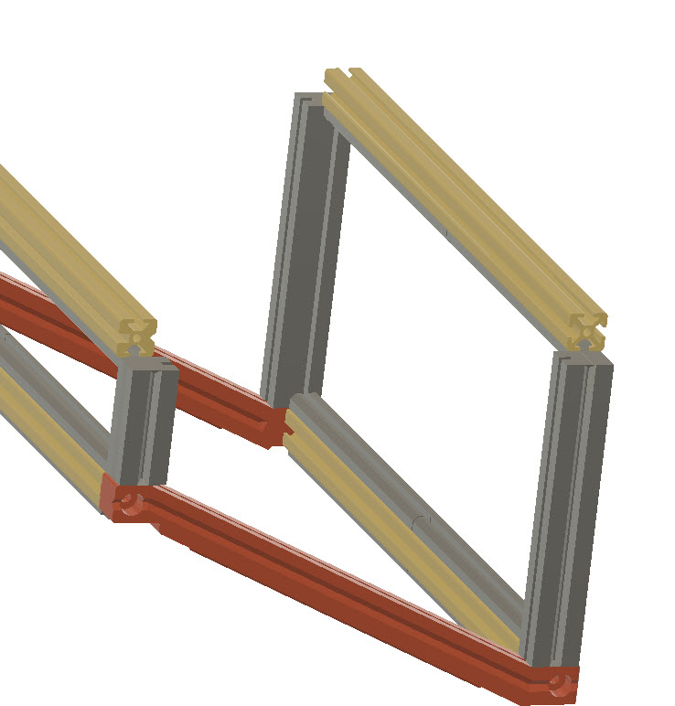

4. Insert the left panel, and attach the left HatSideBar (upper bar), this screws into the two 2020 extrusions

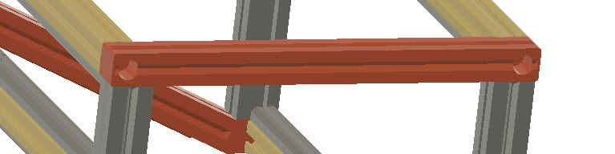

5. Finally insert the top and remaining side clear panels, the right HatSideBar can now be attached.
Note: this will require some of the surrounding bolts to be loosened to allow the panels to fit into the sidebar.

Re-tighten the bolts.

### Base cover

The stl/BaseCover folder contains files for creating a simple magnetic snap-on base cover.

[Video Here](https://youtube.com/shorts/HE4AY-ndGrg)

The Base.3mf file contains the slicer settings needed to create the hex pattern on the base.

Alternatively, open the left stl file in a slicer and split-to-parts. 
The inner part needs modifying to have 

- zero wall-loops, top-shell-layers and bottom-shell-layers.
- Sparse-Infill pattern: Honeycomb at 10%

Repeat this for the right stl.

